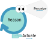
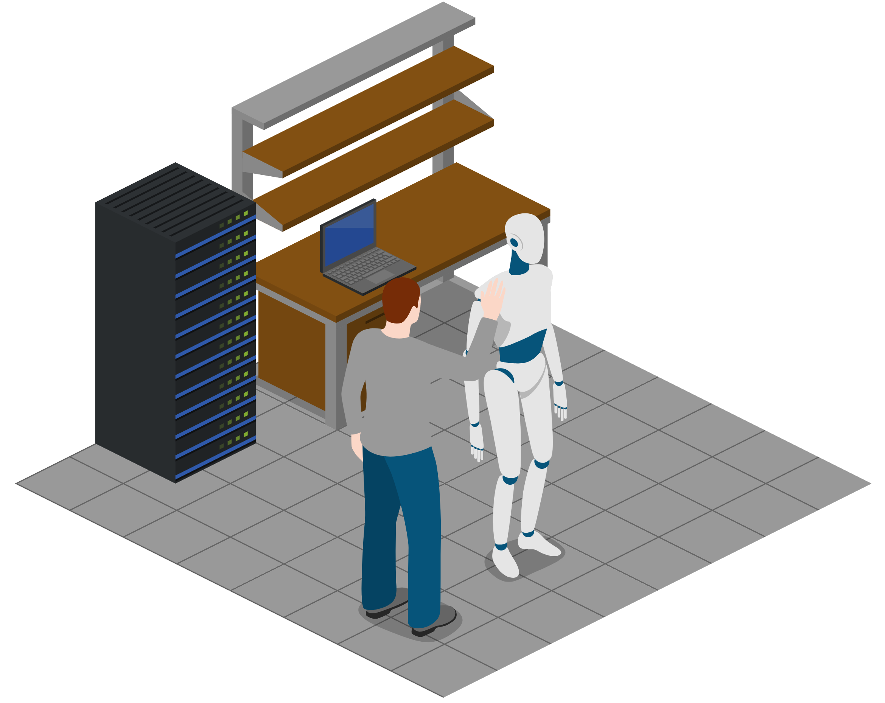
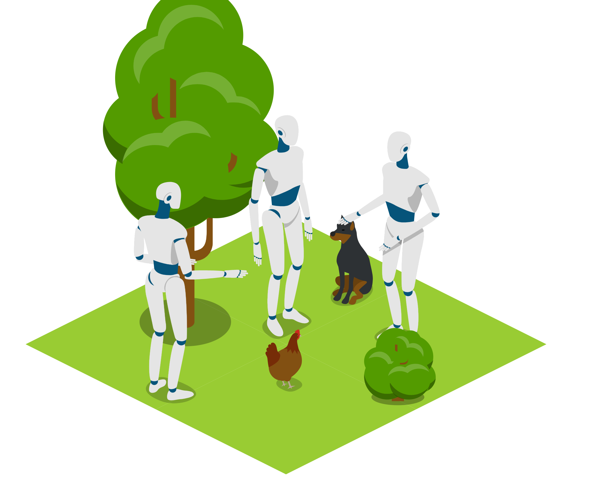
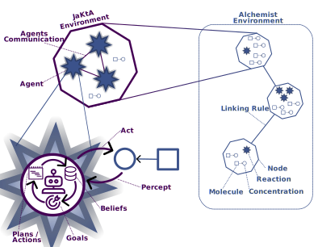

+++
title = "Validation of BDI MASs via Simulation"
outputs = ["Reveal"]
+++

# Validation of <span class="highlight"> BDI </span> MAS 
# via Simulation

<br>

Martina Baiardi

<small>Department of Computer Science and Engineering (DISI)<br>
Alma Mater Studiorum — Università di Bologna <br>
Via dell’Università 50, 47522 Cesena (FC), Italy </small>

---

# <span class="highlight"> BDI </span>

## <span class="highlight">B</span>eliefs, <span class="highlight">D</span>esires, <span class="highlight">I</span>ntentions


{}
{}

- It's a framework to model Multi-Agent Systems through *Goals*
- Reduces the *abstraction gap* between *cognitive abstractions* and the abstractions of common paradigms
  - Mimicking human-level notions such as *beliefs*, *desires* and *intentions*

{}
{}



{}
{}

---
# <span class="highlight"> BDI </span>

## <span class="highlight">B</span>eliefs, <span class="highlight">D</span>esires, <span class="highlight">I</span>ntentions

<br/>

{}
{}

### three main abstractions:

- *Beliefs*: mental state of the agent, that changes over time.
- *Desires*: motivational state of the system.
- *Intentions*: deliberative state of the agent.

{}
{}

{}

## Under the hood...


{}

{}
{}

<div>

<small style="text-align: left"> 
--- <br/>
[1] Bratman, Michael. "Intention, plans, and practical reason." (1987) <br />
[2] Anand S. Rao and Michael P. Georgeff. "BDI agents: From theory to practice." (1995) <br />
[3] Anand S. Rao. "Agentspeak(L): BDI agents speak out in a logical computable language." (1996) 
</small>
</div>


---

{}
{}


## development and testing

{}
{}

{}

<span style="font-size:200px">
  <i class="fa-solid fa-arrows-left-right" style="font-size:150px"></i> 
  <span class="highlight" >?</span> 
  <i class="fa-solid fa-arrows-left-right" style="font-size:150px"></i> 
</span>

#### <span class="highlight"> How can I ensure the system <br/>works as expected?

{}

{}
{}


## deployment

{}
{}

---

## Proposal:
### Simulation as a *validation* tool for BDI systems

<br/>

Simulate the *exact* BDI MAS codebase that will run in the deployment, <br />
to determine if the system works as expected.

As a programmer I want to *switch arbitrarily* between execution and simulation, <br/> 
when needed (for example in test automation).

---

## Research questions

<br/>

### 1. Is the proposal feasible?

### 2. Tool choice
- Which tools are suitable for this integration?
  - The BDI tool must be *modular* to allow its execution inside a simulator
  - The simulator abstractions must be *flexible* enough to model BDI upon it

### 3. Mapping 
- How BDI events can be captured in simulation? *DES* vs.*DTS* 
- At which *granularity* BDI lifecycle *events* should be captured in simulation abstractions?
  - How to model the interaction with *environmental sources of change*?
  - How to preserve *determinism* to reproduce source of errors?
  - How to model *inter-agent communication* in a simulated environment?


---

## Current Results
#### Feasibility and Tool Choice

Initial answer to **1** and **2** research questions through a practical prototype <br/> 
integrating the *JaKtA* BDI framework with the *Alchemist* simulator, <br/>
showing that integration with no code changes to the BDI specification is feasible.

<br/>

{}
{}

#### *JaKtA*: <u>Ja</u>son-like <u>K</u>o<u>t</u>lin <u>A</u>gents [1]

* BDI framework implemented in Kotlin
* Tries to reduce the complexity gap for non-BDI programmers
* <u>Architecture based on modularity</u>


{}

{}

#### *Alchemist* Simulator [2]

- Simulator for pervasive, aggregate, and *nature-inspired* computing
- Based on a *incarnation-agnostic* simulation *engine*
- <u>Architecture based on modularity</u>

{}
{}

<br />
<br />

<div>
<small style="text-align: left"> 
---<br/>
[1] Baiardi, M., Burattini, S., Ciatto, G., & Pianini, D. (2023, September). JaKtA: BDI Agent-Oriented Programming in Pure Kotlin. <br/>
[2] Pianini, D., Montagna, S., & Viroli, M. (2013). Chemical-oriented simulation of computational systems with ALCHEMIST. Journal of Simulation, 7(3), 202–215.
</small>
</div>

---

## Current Results
#### Mapping decisions


{}
{}



{}
{}

<span class="px-5">

- Discrete Event Simulator (*DES*) is a promising approach 
  - since BDI is based on events
- Different possible event granularity mappings identified
  - Atomic MAS Advancements 
  - Atomic Control-Loop Iterations
  - Atomic Control-Loop Phase 
  - Atomic BDI Event
- BDI as a syntactical *extension* for the simulation 

</span>

{}
{}

---

{}
{}

## Future work
JaKtA is still in its early stages, in the future we plan to: 
* *Performance analysis* of the prototype
* Adopt simulation for *Debugging* BDI systems:
  * Breakpoints?
  * Which abstractions show in the variable explorer   
* *Distributed Simulation*
* *Realtime monitoring* of distributed simulations

{}
{}

## JaKtA + Alchemist 
### Prototype available!
<br />

[github.com/jakta-bdi/jakta](https://github.com/jakta-bdi/jakta)


{}
{}

---

## Thank you!

---

# JaKtA: <br> <u>Ja</u>son-like <u>K</u>o<u>t</u>lin <u>A</u>gents [1]

Internal Domain-Specific Language (DSL) implemented in Kotlin

* Multi-paradigm support: OOP + FP + BDI AOP
* Hosted on a mainstream language: gentle learning curve
  * Great learning resources for Kotlin
  * Significantly large community for help
* Reuses the entire existing Kotlin toolchain
  * Developed and *maintained* by the language maintainers and the community
  * Maintenance is greatly reduced
* Good ergonomy

<br />
<br />

<div>
<small style="text-align: left"> 
---<br/>
[1] Baiardi, M., Burattini, S., Ciatto, G., & Pianini, D. (2023, September). JaKtA: BDI Agent-Oriented Programming in Pure Kotlin. 
</small>
</div>

---


## Jakta: multi-paradigm AOP/BDI+OOP+FP


```kotlin
mas {                                                   // BDI specification
  fun allPlayers(team: String) =
    Regex("""<a\s(\X*?)\sdata-cy="player">(.*)<\/a>""") // Object-oriented regex library
        .findAll(URL("https://www.besoccer.com/team/squad/$team").readText())
        .map { team to it.groupValues[2] }              // Lambda expression (Functional style)

  listOf("napoli", "milan", "internazionale")           // Kotlin standard library
      .flatMap(::allPlayers)                            // Higher-order function (Functional style)
      .forEach { (team, player) ->                      // Destructuring declaration
          agent(player) {
              beliefs { fact { squad(team) } }
              goals { achieve(start) }
              plans {
                  +achieve(start) onlyIf { squad(S).fromSelf } then {
                      execute(print("Hello! I play for", S))
                  }
              }
          }
      }
}.start()
```
